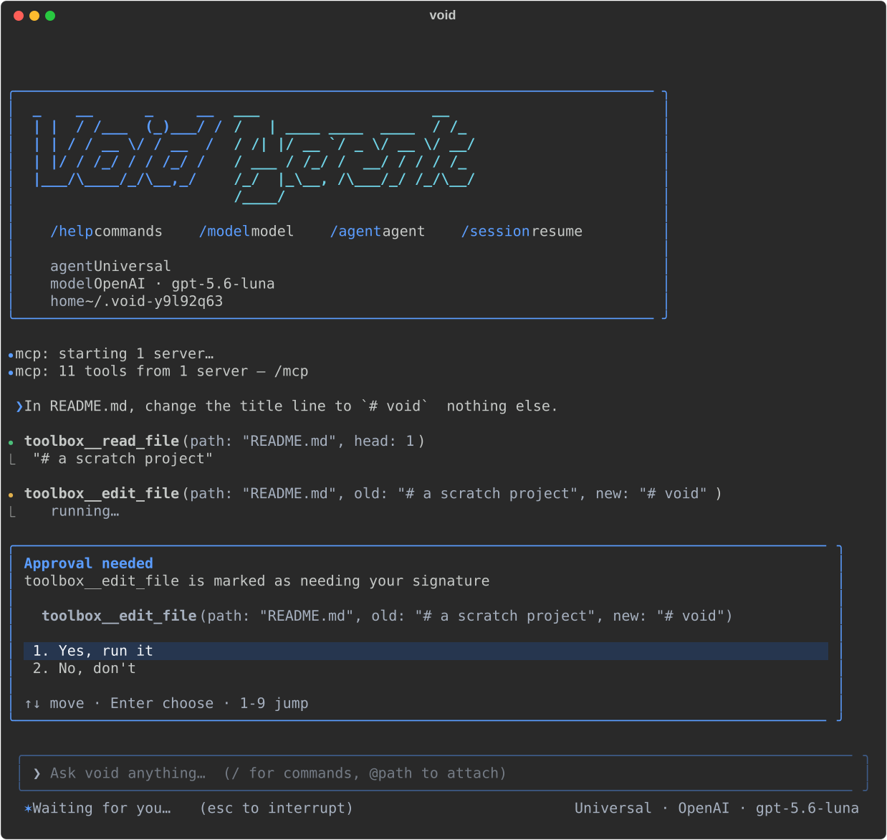
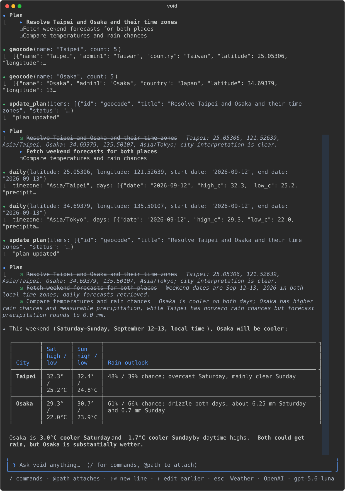

# void-agent

```text
 _    __      _     __     ___                    __
| |  / /___  (_)___/ /    /   | ____ ____  ____  / /_
| | / / __ \/ / __  /    / /| |/ __ `/ _ \/ __ \/ __/
| |/ / /_/ / / /_/ /    / ___ / /_/ /  __/ / / / /_
|___/\____/_/\__,_/    /_/  |_\__, /\___/_/ /_/\__/
                             /____/
```

> Session remembers · Turn runs · Model schedules · Tool executes & asks · Human answers · Message wakes.

void-agent lets you write an agent the way you write code: every capability
is a tool, every workflow is a function, and every question — an approval
or an answer — goes straight to the person from wherever it arose.

- **Everything is a tool, mounted as the agent needs.** Workflows,
  sub-agents, MCP tools, Markdown skills, and the person — the same
  `.tool(...)` call mounts any of them.
- **Workflows are code.** A plain async function takes typed input and an
  `EventSender` and invokes its own tools. No graph DSL — code already
  expresses control flow.
- **The channel is direct.** The stream flows straight out as Vercel AI SDK
  UI messages. Agents and tools at any depth ask the person for approval or
  answers through the same channel. The answer returns to the frame that
  asked, with no parent relay.
- **Approval is mechanical.** `approval` reads this call's validated input
  and decides in code, before the handler. The person says yes or no; the
  model never decides.
- **A session is a conversation.** The messages are the state — one
  projection for the UI, one for the model. No task, no journal, no resume.
- **About 2,000 lines, pydantic only.** One concept per file; provider
  SDKs behind optional extras.

## The framework

### Install

Python 3.12+. Extras: `openai`, `anthropic`, `mcp` — keep the ones you need
in the brackets, or none for the pydantic-only core.

**Online, nothing to download.** pip fetches the wheel from the release:

```bash
pip install "void-agent[openai,anthropic,mcp] @ https://github.com/hoyipyik/void-agent/releases/download/v0.1.0/void_agent-0.1.0-py3-none-any.whl"
```

**From a wheel.** Download one from
[Releases](https://github.com/hoyipyik/void-agent/releases):
`void_agent-<version>-py3-none-any.whl` runs anywhere; the `cp312` /
`cp313` / `cp314` wheels are the same package with `core/` and `providers/`
compiled, one per platform.

```bash
pip install "./void_agent-0.1.0-py3-none-any.whl[openai,anthropic,mcp]"
```

**From source.** Clone and install the checkout:

```bash
git clone https://github.com/hoyipyik/void-agent && cd void-agent
pip install ".[openai,anthropic,mcp]"       # or `uv sync` to hack on it, then `make check`
```

The checkout also builds the two wheels above. The pure-Python one, with
the sdist:

```bash
uv build                    # dist/
```

or the native one, for this OS, CPU and Python:

```bash
make compile                # dist/; PY=3.13 picks the interpreter
```

`make compile-verify` is `make compile` followed by the whole test suite
against the installed wheel in a fresh venv; `scripts/compile.py` is behind
both.

### Usage

A weather agent in a script: one tool that asks [Open-Meteo](https://open-meteo.com)
(no key needed), one question, one answer. The model is whichever key is in
the environment — an OpenAI-compatible endpoint or an Anthropic-compatible
one.

```python
import asyncio
import json
import os
from typing import Any
from urllib.parse import urlencode
from urllib.request import urlopen

from pydantic import BaseModel

from void_agent import Agent, Answer, Llm, Message, tool


class City(BaseModel):
    city: str


def get_json(url: str, **params: object) -> dict[str, Any]:
    with urlopen(f"{url}?{urlencode(params)}") as response:
        return json.load(response)


@tool(description="Current weather for a city.")
async def weather(input: City) -> dict[str, object]:
    found = await asyncio.to_thread(
        get_json, "https://geocoding-api.open-meteo.com/v1/search", name=input.city, count=1
    )
    place = found["results"][0]
    now = await asyncio.to_thread(
        get_json,
        "https://api.open-meteo.com/v1/forecast",
        latitude=place["latitude"],
        longitude=place["longitude"],
        current="temperature_2m,relative_humidity_2m,wind_speed_10m,weather_code",
    )
    return {"place": f"{place['name']}, {place['country']}", **now["current"]}


def model() -> Llm:
    if os.environ.get("ANTHROPIC_API_KEY"):
        from void_agent.providers.anthropic import AnthropicLlm

        return AnthropicLlm("claude-sonnet-5")
    from void_agent.providers.openai import OpenAiLlm

    # reasoning-tier models take function tools on Chat Completions only with this
    return OpenAiLlm("gpt-5.6-luna", extra={"reasoning_effort": "none"})


agent = (
    Agent(model(), "weather", "answers weather questions")
    .prompt(lambda question: [Message.user(question)])
    .tool(weather)
)


async def main() -> None:
    result = await agent.run("What's the weather in Tokyo right now?")
    assert isinstance(result, Answer)
    print(result.value)


asyncio.run(main())
```

#### Models

Two adapters. Each reads its key from the environment and speaks to every
endpoint compatible with its API.

| Adapter | Extra | Construct | Environment |
| --- | --- | --- | --- |
| `OpenAiLlm` — OpenAI and any Chat Completions-compatible endpoint | `openai` | `OpenAiLlm("gpt-5.6-luna", extra={"reasoning_effort": "none"})` | `OPENAI_API_KEY`; `OPENAI_BASE_URL` for another host, e.g. Ollama at `http://localhost:11434/v1` with any key |
| `AnthropicLlm` — Anthropic and any Messages-compatible endpoint | `anthropic` | `AnthropicLlm("claude-sonnet-5")` | `ANTHROPIC_API_KEY`; `ANTHROPIC_BASE_URL` for another host |

Reasoning-tier OpenAI models reject function tools on Chat Completions
unless `reasoning_effort` is `"none"`; leave `extra` out for other models.

### MCP

An MCP server's tools mount on an agent exactly like local ones. What the
server does not bring is the approval: whether a call must be signed by the
person is declared on your side, per tool name. It needs the `mcp` extra.

```python
from void_agent.mcp import McpServer


def must_sign(input: dict[str, object]) -> str | None:
    return f"writing {input['path']} is not reversible"  # a reason, or None to let it run


async def with_files() -> None:
    async with McpServer.stdio(
        "npx", "-y", "@modelcontextprotocol/server-filesystem", "/data"
    ) as files:
        assistant = Agent(model(), "files", "a file assistant").prompt(
            lambda question: [Message.user(question)]
        )
        for capability in files.tools(approvals={"write_file": must_sign}):
            assistant.tool(capability)
        print(await assistant.run("What is in /data?"))
```

- `McpServer.stdio(command, *args, env=…)` runs a server as a subprocess;
  `McpServer.http(url, headers=…)` connects to a hosted one, `headers`
  carrying its token. Keep the `async with` open for as long as the agent
  may run: the connection is a lifecycle, not a call.
- `files.names` lists the tools; `files.describe(name)` is the server's own
  descriptor; `files.tool(name, approval=…)` mounts one;
  `files.tools(approvals={…}, prefix="files__")` mounts them all, namespaced
  so two servers can both offer `search`.
- A gated call is put to whoever attends the run (`agent.run(…, human=…)`).
  With nobody attending, the turn ends with the card open instead of running
  it — the model never decides whether a side effect runs.

## The terminal UI

There is also a terminal UI, for trying the framework before writing a
line and for using an agent day to day. `void` is the same runtime in a
terminal: one binary per platform, nothing to install — the UI, the
agents, the MCP SDK and ripgrep inside.



Four ways in.

**The binary.** Download `void-agent-cli-<platform>` from
[Releases](https://github.com/hoyipyik/void-agent/releases) — Linux x86_64
and arm64, macOS Intel and Apple Silicon, Windows — and run it:

```bash
chmod +x void-agent-cli-macos-arm64 && ./void-agent-cli-macos-arm64
```

macOS asks once the first time: right-click → Open, or
`xattr -d com.apple.quarantine void-agent-cli-macos-arm64`.

**From a checkout.** uv installs the CLI's dependencies with the rest:

```bash
git clone https://github.com/hoyipyik/void-agent && cd void-agent
make setup                  # uv sync, .env from .env.example
make cli                    # reads .env for the key; the same as `uv run python -m cli`
```

**With your own agents.** A folder of them, one module each, any
`build_agent(llm) -> Agent`; `~/.void/agents` is read on its own, a
workspace when named, and `--agent` picks the one to start on:

```bash
./void-agent-cli-macos-arm64 --workspace ./agents --agent researcher
```

**As your own binary.** The same packer the release runs:

```bash
make cli-build              # dist/void, this checkout's ripgrep inside; FETCH=1 fetches the official one
```

On first start it asks for a provider and a key — or reads
`ANTHROPIC_API_KEY`, `OPENAI_API_KEY` or `OLLAMA_MODEL` from the
environment. `/model` lists the Anthropic and OpenAI models, then whatever
a local Ollama has installed. Sessions and the config live under `~/.void`;
`VOID_HOME` moves them.

Three agents come built in; `/agent` switches:

- **universal** — the model, a live plan, reflection, `ask_user`, and every
  tool the process mounted: void's own **toolbox** over the directory you
  started in (read, list, search with ripgrep, write, edit, move, run),
  whatever `~/.void/mcp.json` names, and whatever skills `~/.void/skills`
  holds. Every mounted tool is a switch in `/mcp` and `/skill`: on, signed,
  or off. The toolbox starts `signed`: each call shows you a card first.
  Edit `mcp.json` while the shell runs: the next `/mcp` picks it up.
- **weather** — below.
- **dummy_weather** — the weather agent replayed on a scripted model and
  canned data: no key, no network, the whole protocol on screen.
- **Yours** — a file in a folder; below.

`/` opens the command menu: `/model`, `/key`, `/agent`, `/mcp`, `/skill`,
`/session`, `/new`, `/clear`, `/attach <path>`, `/paste`, `/status`,
`/help`, `/quit`. Drop a file into the composer or write `@path` to attach
it; ⌘V / ctrl+v pastes an image from the clipboard. ↑ in an empty composer
rewinds to an earlier message to edit and resend. Esc stops a turn.

### Your own agents

Agents are files. Put a module under `~/.void/agents`, or in any folder
you name with `--workspace`, and `/agent` lists it: the file's stem is its
name, the first line of its docstring the blurb. Nothing is registered —
the folder is the registry, and every agent in it can call every other by
name.

```python
# ~/.void/agents/writer.py
"""writes a short piece from the notes it is given"""

from void_agent import Agent, Llm


def build_agent(llm: Llm) -> Agent:
    # A sub-agent takes typed input — a string here — as its opening message.
    return Agent(llm, "writer", "writes a short piece from notes", input_type=str).with_system(
        "Write it up in three paragraphs, plainly."
    )
```

```python
# ~/.void/agents/researcher.py
"""finds sources and hands them to the writer"""

from void_agent import Agent, Llm


def build_agent(llm: Llm, agents) -> Agent:
    return (
        Agent(llm, "researcher", "finds and summarises sources")
        .with_system("Find what the question needs, then hand it to the writer.")
        .tool(agents("writer"))  # writer.py beside it, built on the same model
    )
```

```text
Select an agent
●  1. universal      built-in        the model, a plan, a question — and whatever MCP you mounted
   2. dummy_weather  built-in        the weather agent replayed on a scripted model and canned data — no key, no network
   3. weather        built-in        Open-Meteo: forecasts, hours, history — ask it anything about the weather
   4. researcher     ~/.void/agents  finds sources and hands them to the writer
   5. writer         ~/.void/agents  writes a short piece from the notes it is given
```

Pick `researcher`, ask it something, and its `writer` call renders in the
log like any tool's: the question goes to the model, the researcher hands
the notes over, the writer's answer comes back as the call's result. The
rules, all of them:

- **A builder that takes a second argument is handed the pool.**
  `agents("writer")` is the writer beside the caller if there is one, else
  the pool's by name — every agent loaded, from every folder, built on the
  same model. `agents.mounted` is every tool the process mounted (the
  toolbox, `mcp.json`, skills) for a sub-agent that should have them; the
  agent you talk to gets them regardless.
- **A module without `build_agent` is a helper**, never listed; its
  siblings import it as `from . import helper`, a sub-folder as
  `from .shared import tools`.
- **A name taken by an earlier folder is suffixed, never replaced.** Two
  `writer.py` are `writer` and `writer-1`, both rows with their source, and
  `agents("writer-1")` reaches the second from anywhere. The built-in
  three come first, then `~/.void/agents`, then each `--workspace` in
  order.
- **What cannot run is on its row, in red, before you pick it:** a file
  that will not import, a name that is not there, a cycle (`a → b → a`).
  Every builder runs once at scan on a scripted model, so a broken graph
  shows at start, not on the first turn.
- **A new file shows on the next `/agent`; an edit needs a restart.** The
  working directory is never scanned — importing a module runs it, and
  only a folder you named is yours.

### The weather agent

Five thin tools over [Open-Meteo](https://open-meteo.com) — `geocode`,
`current`, `hourly`, `daily`, `history` — no key, and the model as the
scheduler. Each tool is one request; the intelligence is in how the model
schedules them, so the questions can be as awkward as you like:

- *Which of Taipei, Osaka and Singapore is coolest this weekend, and will
  any of them get rain?* — three places resolved in one step, three `daily`
  calls in the next, then a table.
- *When tomorrow does the wind in Berlin drop below 20 km/h?* — `hourly`
  for the right date in Berlin's own timezone, then the model reads the
  hours.
- *How much warmer is London this week than the same week last year?* —
  `daily` and `history` side by side, the difference computed in the answer.
- *What's it like in Springfield?* — `geocode` returns several; the agent
  asks you which, on a card, and carries on with your answer.



The plan updates as it goes; when a result surprises it, it reflects
before continuing. `cli/agents/weather.py` is the whole thing: the tools, the
system prompt, `build_agent`; `dummy_weather.py` beside it is the same agent
on a scripted model.

## License

MIT
